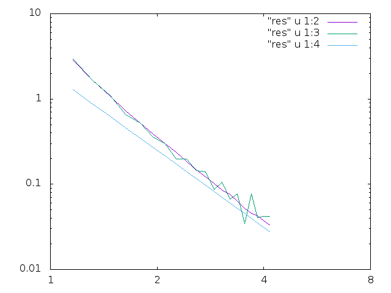

# Final Exam

Final Project II

In this project, we are tasked to calculate the total energy of interactions of two identical cubes that are oriented such that their corresponding edges are parallel to the coordinate axes and are displaced with respect to each other along the X-axis. The cubes are charged with a non-uniform charge density and are separated by distance r. 

To do so, we needed to compute a six dimensional integrator for each of the 3 local coordinates of the cube. 3 different methods were used to compute the integral:

* GSL VEGAS – Purple line
* Homemade Integrator(Monte Carlo) – Green line
* Dipole Approximation – Blue line

The graph produced by the program is as follows:

The excution time for the GSL Vegas Integration method is around 280 secs. whereas, the the homemade integrator was around 16 secs. However, the Monte Carlo Integratos method converges to 1/sqrt(N) where N is total number of steps. In order for the homemade method to achieve the same amount of accuracy as the VEGAS method, the computations have to be increased by a factor of 10^2. This means that to achieve the same level of accuracy, the homemade integrator would have a run time of about 45 minutes.

This project was a collobaration between myslef and

* Paul Young
* Christine Caron

